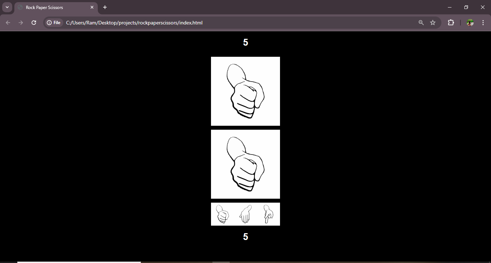

<h1>Rock paper scissor</h1>
<h3> summary </h3>

  A rock-paper-scissors game built with HTML, CSS, and JavaScript provides an interactive and engaging experience for users, showcasing the fundamentals of front-end web development. In this project, HTML is used to structure the game elements, such as buttons for selecting rock, paper, or scissors, and a display area for game results. CSS styles the game, making it visually appealing and responsive, with custom designs for buttons and text to enhance user experience. JavaScript adds the core functionality, handling user input, generating the computer's random choice, and determining the winner based on the classic rules: rock beats scissors, scissors beat paper, and paper beats rock. With JavaScript, the game can dynamically update the score and display outcomes with each round, making the game interactive. This project demonstrates practical use of JavaScript for logic implementation and DOM manipulation, while HTML and CSS create the structure and style, resulting in a fun, browser-based game.

